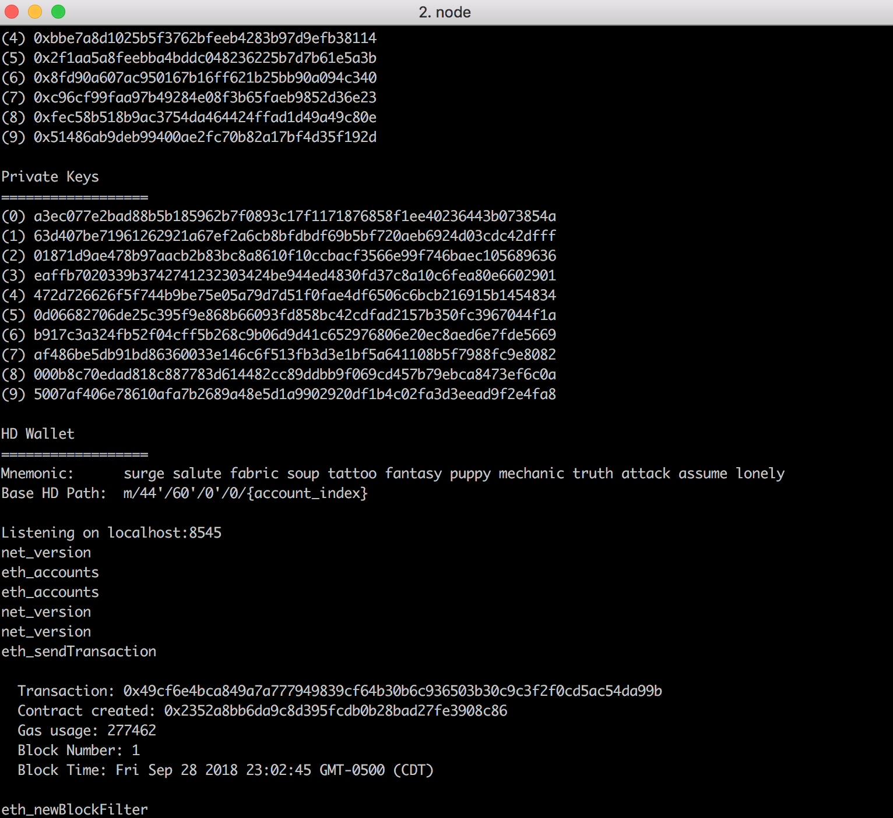

# Hack a Thing 2
## Decentralized Voting with Ethereum, Truffle, and Ganache

### Emma Kennelly and Emily Pitts

### What we worked on

With recent elections taking place as well as Greek rush, our idea was to create a new, more reliable voting system. We also were interested in learning more about blockchain decentralized apps, so we fused  the two ideas together to create a decentralized voting app that enhances security, transparency, and efficiency.

We started by following a tutorial online: https://medium.freecodecamp.org/developing-an-ethereum-decentralized-voting-application-a99de24992d9

This tutorial recommended using an already-existing git repo containing code for Truffle/Ethereum contracts and javascript for a voting system. However, we decided to try starting a Truffle project from scratch and follow along to the tutorial from there to gain a better understanding of Truffle.

So, we downloaded the Truffle package and followed these steps:
`truffle init` to create a new Truffle project.
`truffle compile`
`truffle migrate` to migrate contracts onto the blockchain.

From there, we added our own contract `Voting` holding the logic for voting for candidates.

We used Ganache to locally deploy our contracts onto the blockchain. We tested this both using the Ganache desktop app as well as the ganache-cli. Below is a screenshot of the output from `truffle migrate` while ganache is running at local port 8545.

### What went wrong
We really wanted to get the blockchain logic working so that we could create a nice, UI-friendly voting app, but we kept getting stuck with our contract transactions not appearing on the page after emitting an event, i.e. `emit AddedCandidate(uint candidateId);`. After unsuccessfully trying to debug this connection issue, we decided to start from scratch yet again with a new tutorial, which actually provided a pretty decent UI to get us going.

### The final product

We created a very basic voting Contract using an array in storage which indexes candidate IDs to their total votes. The UI allows a user to upvote or downvote a candidate, which in turn creates a transaction to update the candidate's number of votes in storage.

### Moving forward
If we had more time to work on this, we think we have developed a deep enough understanding to create a much more complex application with a more intuitive contract logic for voting, but given the time constraints and the errors we were stuck on, this was a great start.
